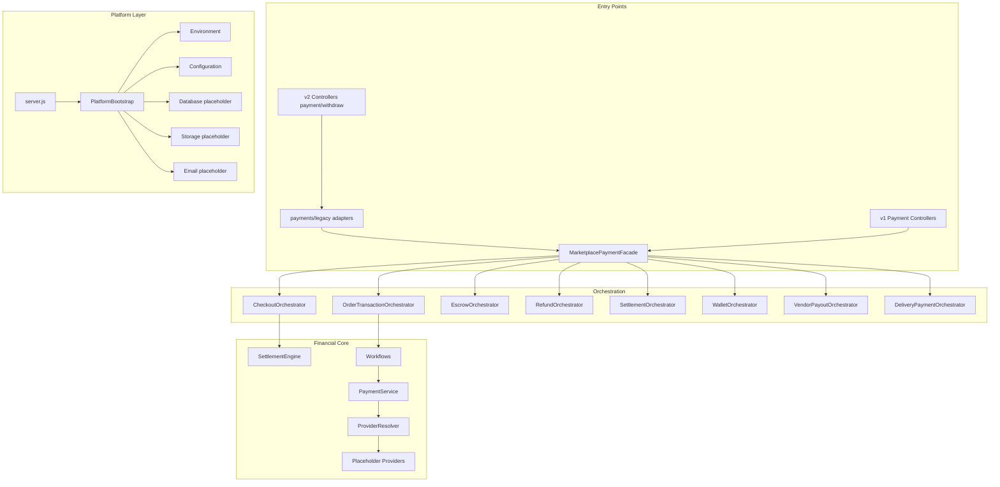

# Baseline Architecture Report

**Architecture Version:** `1.0-production-baseline`  
**Tag:** `v1.0-production-baseline`  
**Date:** 2026-07-12  
**Repository:** `yebone-backend` (Guriraline Server)

---

## Completed Phases

| Phase | Status | Verification |
|-------|--------|--------------|
| Payment Foundation | Complete | Architecture 96/100 |
| Financial Core | Complete | Architecture 96/100 |
| Transaction Orchestration | Complete | Architecture 96/100 |
| API Integration Layer | Complete | Architecture 96/100 |
| Runtime Layer | Complete | Architecture 96/100 |
| Infrastructure Layer (payments) | Complete | Architecture 96/100 |
| Architecture Verification | Complete | 254+ files syntax OK |
| Legacy Payment Migration | Complete | 100/100 |
| Environment & External Services | Complete | Platform 100/100 |
| Frontend Compilation Gate | Complete | Build + lint pass |

---

## Verification Scores

| Script | Score | Result |
|--------|-------|--------|
| `payments/scripts/verify-architecture.js` | 96/100 | PASS |
| `payments/scripts/verify-legacy-migration.js` | 100/100 | PASS |
| `platform/scripts/verify-platform.js` | 100/100 | PASS |

**Known warnings (non-blocking):** duplicate `EscrowReleased` class name; `process.env` in legacy adapter for API key bridge.

---

## Registered Modules

### Payments (`payments/`)

| Layer | Entry | Role |
|-------|-------|------|
| Composition root | `PaymentModule.js` | Wires all payment layers |
| Single entry point | `MarketplacePaymentFacade` | Public orchestration API |
| API | `payments/api/` | v1 controllers → facade only |
| Runtime | `payments/runtime/` | Route registration, DI |
| Orchestration | `payments/orchestration/` | Checkout, order, escrow, refund, settlement, wallet, payout, delivery |
| Financial | `payments/financial/` | Engines, state machines, ledger |
| Workflows | `payments/workflows/` | Provider-independent flows |
| Providers | `payments/providers/` | Placeholders (NotImplementedError) |
| Legacy bridge | `payments/legacy/` | v2 adapter → facade |
| Infrastructure | `payments/infrastructure/` | Memory providers, health, logging |

### Platform (`platform/`)

| Module | Services |
|--------|----------|
| `environment/` | Loader, schema, validator, profiles |
| `configuration/` | App, DB, storage, email, payment placeholders, security, logging |
| `secrets/` | Placeholder provider, registry, resolver |
| `database/` | PostgreSQL placeholder, migrations, seeds, repositories |
| `storage/` | Local + Cloudinary placeholder |
| `email/` | SMTP + Resend placeholders |
| `deployment/` | Production bootstrap, startup checks |
| `health/` | Liveness, readiness |
| `runtime/` | `PlatformBootstrap`, route registration |

---

## API Endpoints

### v1 Payments (`/api/v1/payments/*`) — 18 routes

| Method | Path |
|--------|------|
| POST | `/api/v1/payments/checkout` |
| POST | `/api/v1/payments/orders` |
| POST | `/api/v1/payments/orders/capture` |
| POST | `/api/v1/payments/wallets/credit` |
| POST | `/api/v1/payments/wallets/debit` |
| POST | `/api/v1/payments/escrow/hold` |
| POST | `/api/v1/payments/escrow/release` |
| POST | `/api/v1/payments/refunds/request` |
| POST | `/api/v1/payments/refunds/approve` |
| POST | `/api/v1/payments/settlements/settle` |
| POST | `/api/v1/payments/settlements/preview` |
| POST | `/api/v1/payments/subscriptions/create` |
| POST | `/api/v1/payments/subscriptions/activate` |
| POST | `/api/v1/payments/payouts/request` |
| POST | `/api/v1/payments/payouts/approve` |
| POST | `/api/v1/payments/delivery/prepare` |
| POST | `/api/v1/payments/delivery/settle` |
| GET | `/api/v1/payments/health` |

### v2 Marketplace (legacy, preserved)

`/api/v2/user`, `/conversation`, `/message`, `/order`, `/shop`, `/product`, `/event`, `/coupon`, `/payment`, `/withdraw`, `/flashsale`, `/bids`, `/commission`

### Platform Health

| Method | Path |
|--------|------|
| GET | `/health` |
| GET | `/health/liveness` |
| GET | `/health/readiness` |

---

## Health Status

| Probe | Endpoint | Status |
|-------|----------|--------|
| Payment module | `GET /api/v1/payments/health` | Registered |
| Liveness | `GET /health/liveness` | Registered (Render `healthCheckPath`) |
| Readiness | `GET /health/readiness` | Registered |
| Platform DI | 11 services | Resolved at bootstrap |

---

## Dependency Graph Summary

---

## Facade Enforcement (Baseline Verified)

| Rule | Status |
|------|--------|
| `MarketplacePaymentFacade` is single payment entry point | Verified |
| No controller imports Stripe/Flutterwave/Paypack/MTN/Airtel SDK | Verified |
| v1 controllers use facade only | Verified |
| v2 payment/withdraw delegate via legacy adapters | Verified |
| Providers are placeholders only | Verified |

---

## Production Readiness

| Area | Status |
|------|--------|
| Architecture frozen | Yes |
| Provider integrations | Not started (by design) |
| MongoDB (legacy) | Unchanged |
| PostgreSQL | Placeholder only |
| Render deployment | `render.yaml` present |

**Baseline frozen at tag `v1.0-production-baseline`.**
