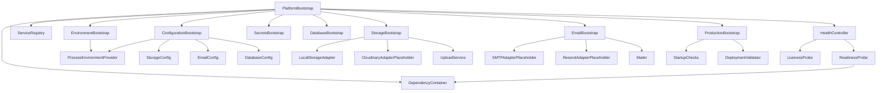
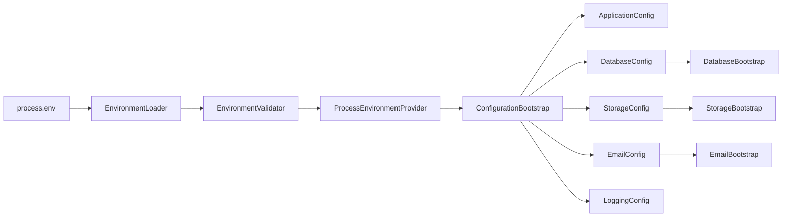
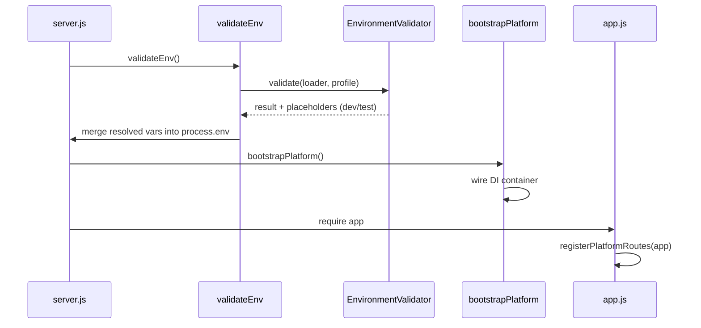
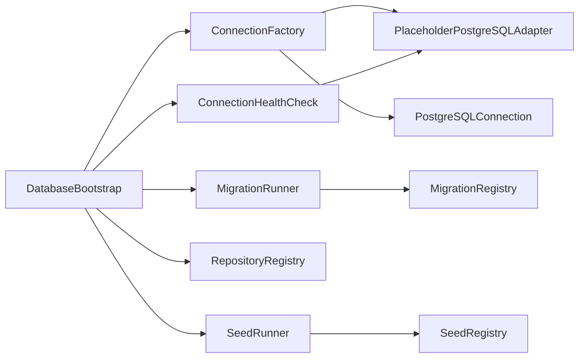
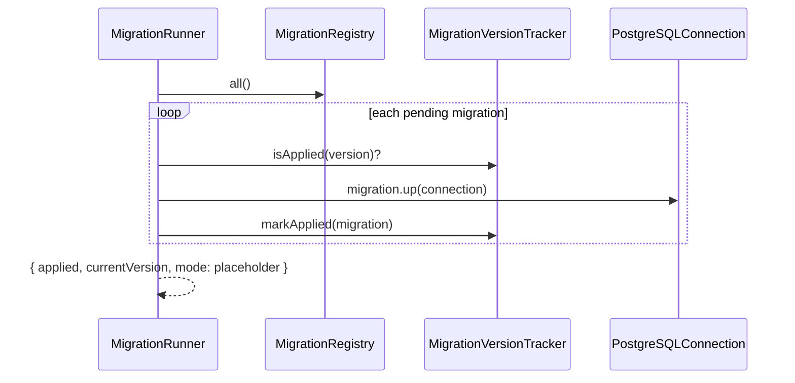
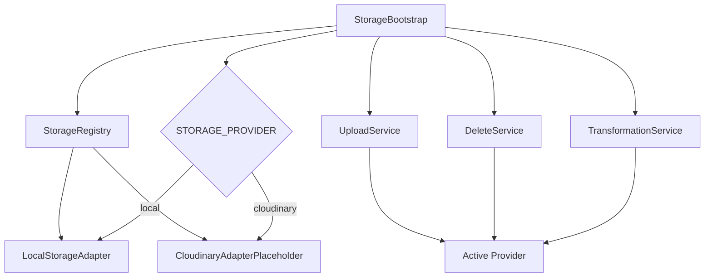
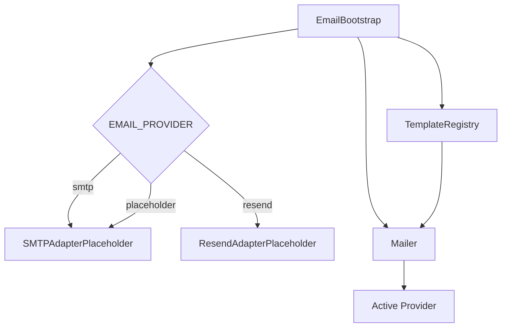
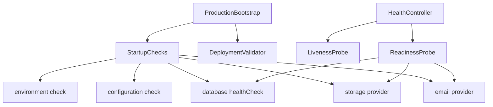

# Environment & External Services — Phase Report

**Project:** Guriraline Backend  
**Phase:** Environment & External Services (Platform Layer)  
**Date:** 2026-07-12  
**Verification Score:** **100/100** (12/12 checks passed)

---

## Summary

The platform layer is complete with DI-based composition for environment, configuration, secrets, database (PostgreSQL placeholder), storage, email, deployment, and health probes. Minimal wiring was added to `server.js`, `app.js`, and `config/validateEnv.js`. No changes were made to payments, controllers, models, orders, auth, or marketplace logic.

---

## Folder Tree

```
platform/
├── index.js                          # bootstrapPlatform export
├── PlatformModule.js
├── scripts/
│   └── verify-platform.js
├── di/
│   ├── DependencyContainer.js
│   ├── ServiceRegistry.js
│   └── index.js
├── environment/                      # (pre-existing, complete)
│   ├── EnvironmentBootstrap.js
│   ├── EnvironmentLoader.js
│   ├── EnvironmentSchema.js
│   ├── EnvironmentValidator.js
│   ├── profiles/
│   └── index.js
├── configuration/                    # (pre-existing, complete)
│   ├── ApplicationConfig.js
│   ├── DatabaseConfig.js
│   ├── StorageConfig.js
│   ├── EmailConfig.js
│   ├── LoggingConfig.js
│   ├── ConfigurationBootstrap.js
│   └── index.js
├── secrets/                          # (pre-existing, complete)
│   ├── SecretsBootstrap.js
│   └── index.js
├── database/
│   ├── DatabaseBootstrap.js
│   ├── index.js
│   ├── postgres/
│   │   ├── ConnectionFactory.js
│   │   ├── PlaceholderPostgreSQLAdapter.js
│   │   └── ConnectionHealthCheck.js
│   ├── migrations/
│   │   ├── MigrationRegistry.js
│   │   ├── MigrationRunner.js
│   │   └── migrations/001_initial_placeholder.js
│   ├── seeds/
│   │   ├── SeedRegistry.js
│   │   ├── SeedRunner.js
│   │   └── seeds/001_initial_placeholder.js
│   └── repositories/
│       └── RepositoryRegistry.js
├── storage/
│   ├── StorageProvider.js            # (pre-existing)
│   ├── LocalStorageAdapter.js
│   ├── CloudStorageProvider.js
│   ├── CloudinaryAdapterPlaceholder.js
│   ├── UploadService.js
│   ├── DeleteService.js
│   ├── TransformationService.js
│   ├── StorageRegistry.js
│   ├── StorageBootstrap.js
│   └── index.js
├── email/
│   ├── EmailProvider.js
│   ├── SMTPAdapterPlaceholder.js
│   ├── ResendAdapterPlaceholder.js
│   ├── TemplateRegistry.js
│   ├── Mailer.js
│   ├── EmailBootstrap.js
│   └── index.js
├── deployment/
│   ├── ProductionBootstrap.js
│   ├── StartupChecks.js
│   ├── DeploymentValidator.js
│   ├── RENDER_DEPLOYMENT_GUIDE.md
│   └── index.js
├── health/
│   ├── LivenessProbe.js
│   ├── ReadinessProbe.js
│   ├── HealthController.js
│   └── index.js
└── runtime/
    ├── PlatformBootstrap.js
    ├── registerPlatformRoutes.js
    └── index.js

Project root additions:
├── .env.example                      # updated
├── .env.production.example
├── .env.staging.example
├── .env.test.example
├── render.yaml
└── ENVIRONMENT_EXTERNAL_SERVICES_REPORT.md
```

---

## Dependency Graph



---

## Configuration Flow



---

## Environment Flow



---

## Database Layer



PostgreSQL is **placeholder-only**. MongoDB (`DB_URL`) remains the primary datastore and was not modified.

---

## Migration Infrastructure



---

## Storage Layer



---

## Email Layer



---

## Deployment & Health



**Routes registered:**
- `GET /health`
- `GET /health/liveness`
- `GET /health/readiness`

---

## Verification Results

```
=== Platform Verification ===

  [PASS] file_structure — 32 required platform files
  [PASS] syntax — 82 JS files checked
  [PASS] imports — 11 module entry points
  [PASS] startup — 11 services registered
  [PASS] config — application, database, storage, email, logging, security
  [PASS] di — storage and email wired via DI
  [PASS] migrations — migration/seed infra operational
  [PASS] repositories — RepositoryRegistry ready
  [PASS] env_validation — env templates and validator OK
  [PASS] wiring:validateEnv — delegates to platform
  [PASS] wiring:app.js — registerPlatformRoutes present
  [PASS] wiring:server.js — platform bootstrap present

Score: 100/100
Checks: 12 passed, 0 failed
```

Run: `node platform/scripts/verify-platform.js`

---

## Files Created

| Path | Purpose |
|------|---------|
| `platform/storage/LocalStorageAdapter.js` | Local filesystem storage |
| `platform/storage/CloudStorageProvider.js` | Cloud storage interface |
| `platform/storage/CloudinaryAdapterPlaceholder.js` | Cloudinary placeholder |
| `platform/storage/UploadService.js` | Upload orchestration |
| `platform/storage/DeleteService.js` | Delete orchestration |
| `platform/storage/TransformationService.js` | Transform orchestration |
| `platform/storage/StorageRegistry.js` | Provider registry |
| `platform/storage/StorageBootstrap.js` | Storage DI wiring |
| `platform/storage/index.js` | Module exports |
| `platform/email/EmailProvider.js` | Email interface |
| `platform/email/SMTPAdapterPlaceholder.js` | SMTP placeholder |
| `platform/email/ResendAdapterPlaceholder.js` | Resend placeholder |
| `platform/email/TemplateRegistry.js` | Email templates |
| `platform/email/Mailer.js` | Send API |
| `platform/email/EmailBootstrap.js` | Email DI wiring |
| `platform/email/index.js` | Module exports |
| `platform/deployment/ProductionBootstrap.js` | Production startup |
| `platform/deployment/StartupChecks.js` | Startup validation |
| `platform/deployment/DeploymentValidator.js` | Deploy validation |
| `platform/deployment/index.js` | Module exports |
| `platform/deployment/RENDER_DEPLOYMENT_GUIDE.md` | Render guide |
| `platform/health/LivenessProbe.js` | Liveness probe |
| `platform/health/ReadinessProbe.js` | Readiness probe |
| `platform/health/HealthController.js` | HTTP handlers |
| `platform/health/index.js` | Module exports |
| `platform/runtime/PlatformBootstrap.js` | DI composition root |
| `platform/runtime/registerPlatformRoutes.js` | Route registration |
| `platform/runtime/index.js` | Module exports |
| `platform/PlatformModule.js` | Platform facade |
| `platform/index.js` | `bootstrapPlatform` export |
| `platform/database/index.js` | Database exports |
| `platform/di/index.js` | DI exports |
| `platform/scripts/verify-platform.js` | Verification script |
| `.env.production.example` | Production env template |
| `.env.staging.example` | Staging env template |
| `.env.test.example` | Test env template |
| `render.yaml` | Render deployment config |
| `ENVIRONMENT_EXTERNAL_SERVICES_REPORT.md` | This report |

## Files Modified

| Path | Change |
|------|--------|
| `.env.example` | Added platform vars (POSTGRES_URL, STORAGE_PROVIDER, EMAIL_PROVIDER, LOG_LEVEL, etc.) |
| `config/validateEnv.js` | Delegates to platform `EnvironmentValidator` (backward compat preserved) |
| `app.js` | Added `registerPlatformRoutes(app)` |
| `server.js` | Added `bootstrapPlatform()` before app load |
| `platform/database/DatabaseBootstrap.js` | Fixed relative import paths (`./postgres/` vs `../postgres/`) |

---

## Design Notes

- **No singleton globals** — all services resolved via `DependencyContainer`
- **Placeholder adapters** — Cloudinary, SMTP, Resend, PostgreSQL return placeholder responses
- **No real secrets** — all env templates use placeholder values only
- **MongoDB untouched** — existing schemas and `DB_URL` flow unchanged
- **Payments untouched** — no payment SDK integration in platform layer
