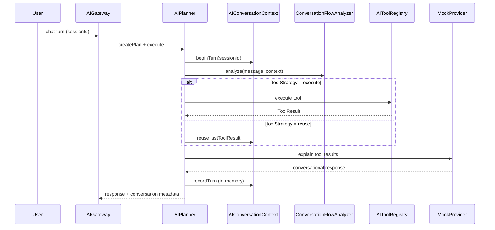

# YEBO AI — Commerce Assistant (Phase 7.4)

**Tag:** `yebo-ai-assistant-v1`  
**Baseline:** `yebo-ai-search-v1`  
**Module:** `marketplace/ai/conversation/`

Related: [AI_SEARCH.md](./AI_SEARCH.md) · [YEBO_AI_ARCHITECTURE.md](./YEBO_AI_ARCHITECTURE.md)

---

## Objective

Transform YEBO AI from a search assistant into a **commerce assistant** that supports multi-turn conversations using existing tool results within an active session.

No persistent memory. No profile storage. Context exists only for the current session.

---

## Conversation Flow



---

## Session Context (In-Memory Only)

`AIConversationContext` stores per `sessionId`:

| Field | Purpose |
|-------|---------|
| `lastToolResult` | Previous tool output for reuse |
| `lastSearchRequest` | Structured filters from NL search |
| `currentProducts` | Products from last tool call |
| `currentFilters` | Active search filters |
| `currentProduct` | Selected product when singular |
| `turnCount` | Active conversation turn counter |

TTL defaults to 30 minutes. No database persistence.

---

## Follow-Up Detection

`ConversationFlowAnalyzer` classifies turns:

| Type | Example | Tool strategy |
|------|---------|---------------|
| `search_refinement` | "Only black ones", "Under 300000 RWF" | **execute** (merged search) |
| `topic_switch` | "Show Apple instead" | **execute** (new search) |
| `result_question` | "Which one has the best battery?" | **reuse** prior ToolResult |
| `new_turn` | Fresh topic without prior context | **execute** |

Planner never bypasses `AIToolRegistry`. Provider never selects tools.

---

## Example Multi-Turn Search

1. **User:** Show Samsung phones.  
   → `SearchTool` executes with `{ brand: Samsung, category: phones }`

2. **User:** Only black ones.  
   → Refines prior `searchRequest`, re-executes `SearchTool`

3. **User:** Under 300000 RWF.  
   → Adds `maxPrice`, re-executes `SearchTool`

4. **User:** Which one has the best battery?  
   → Reuses previous `ToolResult`; MockProvider explains from product list

---

## Gateway Response Additions

Chat responses include:

```json
{
  "conversation": {
    "turnCount": 3,
    "followUp": true,
    "toolStrategy": "reuse",
    "flowType": "result_question",
    "productCount": 5
  },
  "meta": {
    "phase": "7.4",
    "commerceAssistant": true
  }
}
```

---

## Observability

`AIMetrics` tracks:

- `conversationCount`
- `conversationTurns`
- `followUpRequests`
- `toolReuseCount`
- `newToolExecutions`
- `averageTurns`

---

## Frontend Integration

No UI redesign. Existing components reused:

- `GlobalAIFab` / `AIPanel`
- `ConversationPipeline`
- `GatewayAssistantAdapter` — passes stable `sessionId` from `YIPSession`

---

## Verification

```bash
npm run test:ai-assistant
npm run verify:yebo-ai-assistant
```

---

## Out of Scope

Persistent memory, recommendations, checkout intelligence, live LLM providers, semantic search, and agent workflows remain deferred to later phases.
