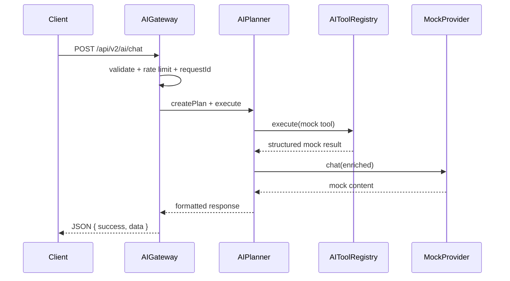

# YEBO AI Gateway — Phase 7.1

**Tag:** `yebo-ai-gateway-v1`  
**Module:** `marketplace/ai/`  
**Design baseline:** `yebo-ai-design-v1`

Related: [YEBO_AI_ARCHITECTURE.md](./YEBO_AI_ARCHITECTURE.md) · [AI_TOOLS.md](./AI_TOOLS.md)

---

## Overview

Phase 7.1 delivers the production AI platform skeleton. The gateway authenticates, validates, rate-limits, and routes requests through the planner to mock tools and the mock provider. **No frozen platform business logic is duplicated or modified.**

---

## Public Endpoints

| Method | Path | Auth | Purpose |
|--------|------|------|---------|
| `POST` | `/api/v2/ai/chat` | Optional | Assistant turn |
| `POST` | `/api/v2/ai/search` | Optional | Search gateway (mock tools) |
| `GET` | `/api/v2/marketplace/ai/health` | Public | AI platform health |

Thin controller: `controller/ai.js` → `AIPlatform.gateway`

---

## Request Lifecycle



---

## Planner Lifecycle

1. **Detect intent** — rule-based keywords (search, order, vendor, etc.)
2. **Select tool** — placeholder tool from registry
3. **Compose prompts** — versioned layers from `AIPromptRegistry`
4. **Execute tool** — mock `execute()` (Phase 7.2 wires platforms)
5. **Call provider** — `MockProvider.chat()`
6. **Format response** — structured JSON with requestId, tool, provider metadata

---

## Provider Lifecycle

| Provider | Phase 7.1 status |
|----------|------------------|
| `mock` | **Active** — all LLM responses |
| `openrouter`, `gemini`, `openai`, `anthropic`, `groq` | Registered placeholders — not active |

Provider keys load from backend env only (`AI_*_API_KEY`). No external API calls in 7.1.

---

## Security (Phase 7.1)

- Optional JWT auth (`optionalAuth` middleware)
- Rate limiting (`chatRateLimiter`, `searchRateLimiter`)
- Message length caps (`AIConfiguration.maxMessageLength`)
- Prompt injection pattern hooks (`AIRequestSecurity`)
- Request IDs on every turn (`crypto.randomUUID()`)
- Structured audit events (no PII in logs)

---

## Frontend Integration

| UI | Transport |
|----|-----------|
| `GlobalAIFab` / `AIPanel` | `GatewayAssistantAdapter` → `POST /api/v2/ai/chat` |
| `AISearchNatural` | `YIPGatewayClient.search()` → `POST /api/v2/ai/search` |
| `useYIP` / `sendMessage` | Gateway adapter (no browser LLM keys) |

Removed from runtime: `REACT_APP_OPENROUTER_API_KEY`, `REACT_APP_GEMINI_API_KEY`

---

## Verification

```bash
npm run test:ai-gateway
npm run verify:yebo-ai-gateway   # gateway + full platform foundation
```

---

## Next Milestone

**Phase 7.2 — Tool Registry** — wire tools to frozen platforms (`SearchPlatform`, etc.)

Do not begin 7.2 until `yebo-ai-gateway-v1` is frozen.
