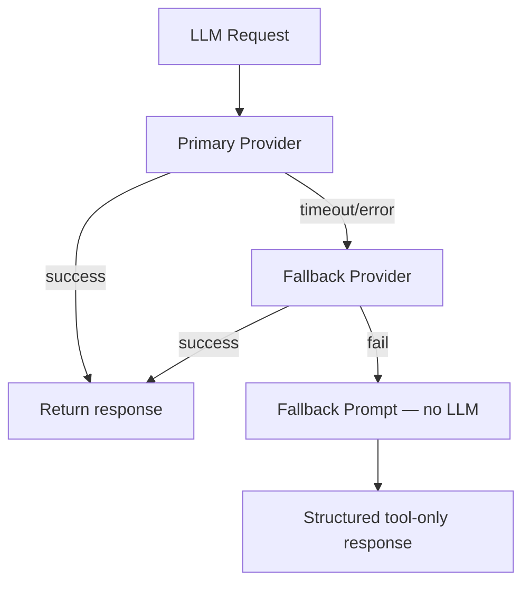

# YEBO AI — Provider Architecture

**Design tag:** `yebo-ai-design-v1`  
**Status:** DESIGN ONLY

Related: [YEBO_AI_ARCHITECTURE.md](./YEBO_AI_ARCHITECTURE.md) · [AI_SECURITY.md](./AI_SECURITY.md)

---

## Principles

1. **Keys stored ONLY on backend** — never `REACT_APP_*` provider keys
2. **Providers are interchangeable** — same prompt + tool contract across all
3. **Failover chain** — primary → secondary → fallback prompt (no LLM)
4. **No provider SDK in frontend** — browser calls gateway only
5. **Cost tracking** — every call records model, tokens, estimated cost

---

## Component: AIProviderManager

Location: `marketplace/ai/AIProviderManager.js`

| Responsibility | Detail |
|----------------|--------|
| Provider selection | Config-driven primary + fallback list |
| Request execution | `complete(messages, tools, options)` |
| Streaming | `stream(messages, tools, options)` → AsyncIterable |
| Schema mapping | Convert `AIToolRegistry` schemas to provider format |
| Health | Per-provider connectivity check (no user data) |
| Failover | On timeout/error → next provider → fallback prompt |
| Cost | Token count × rate table → `AIMetrics` |

---

## Supported Providers (design)

| Provider | Backend env var | Protocol | Priority default |
|----------|-----------------|----------|------------------|
| **OpenRouter** | `AI_OPENROUTER_API_KEY` | OpenAI-compatible REST | Primary |
| **Gemini** | `AI_GEMINI_API_KEY` | Google Generative Language API | Secondary |
| **OpenAI** | `AI_OPENAI_API_KEY` | OpenAI REST | Tertiary |
| **Anthropic** | `AI_ANTHROPIC_API_KEY` | Messages API | Tertiary |
| **Groq** | `AI_GROQ_API_KEY` | OpenAI-compatible REST | Optional fast inference |
| **Future** | `AI_{PROVIDER}_API_KEY` | Plugin interface | Configurable |

---

## Provider Interface (design contract)

```javascript
// Design contract — BaseAIProvider
{
  id: "openrouter",
  name: "OpenRouter",
  capabilities: {
    chat: true,
    stream: true,
    tools: true,
    vision: false,      // Phase 8+
    maxContextTokens: 128000,
  },
  initialize(config): Promise<HealthResult>,
  complete(request: ProviderRequest): Promise<ProviderResponse>,
  stream(request: ProviderRequest): AsyncIterable<string>,
  health(): Promise<HealthResult>,
  estimateCost(usage: TokenUsage): number,
}
```

---

## Configuration

**Component:** `AIConfiguration.js` + env vars

```javascript
// Design defaults — AIConfiguration
{
  primaryProvider: "openrouter",
  fallbackProviders: ["gemini", "openai"],
  models: {
    openrouter: "google/gemma-3-27b-it:free",
    gemini: "gemini-2.0-flash",
    openai: "gpt-4o-mini",
    anthropic: "claude-3-5-haiku-20241022",
    groq: "llama-3.3-70b-versatile",
  },
  temperature: 0.7,
  maxTokens: 1024,
  timeoutMs: 30000,
  streamEnabled: true,
  retryAttempts: 2,
}
```

**Environment variables (backend only):**

| Variable | Required | Purpose |
|----------|----------|---------|
| `AI_OPENROUTER_API_KEY` | At least one provider | OpenRouter |
| `AI_GEMINI_API_KEY` | Optional | Gemini fallback |
| `AI_OPENAI_API_KEY` | Optional | OpenAI |
| `AI_ANTHROPIC_API_KEY` | Optional | Anthropic |
| `AI_GROQ_API_KEY` | Optional | Groq |
| `AI_PRIMARY_PROVIDER` | Optional | Override primary |
| `AI_ENABLE_STREAMING` | Optional | Global stream toggle |

Remove from frontend: `REACT_APP_OPENROUTER_API_KEY`, `REACT_APP_GEMINI_API_KEY`.

---

## Failover Flow



Fallback response uses `fallback@*` prompt template rendered as static user-facing message — includes partial tool results if available.

---

## Streaming Architecture

| Layer | Behavior |
|-------|----------|
| `AIProviderManager.stream()` | Yields token chunks from provider |
| `AIGateway` | SSE `text/event-stream` to frontend |
| `AIConversation` | Buffers partial response; supports cancel via `AbortSignal` |
| Frontend `YIPProvider` | Consumes SSE; updates `partialResponse` state (existing UI) |

Headers: `Cache-Control: no-cache`, `Connection: keep-alive`, `X-Session-Id`.

---

## Frontend Provider Deprecation

| Current (remove) | Replacement |
|------------------|-------------|
| `OpenRouterClient.js` browser fetch | Gateway SSE |
| `GeminiClient.js` browser fetch | Gateway SSE |
| `ProviderFactory` live calls | `YIPGatewayClient` HTTP only |
| `SDKAssistantAdapter` direct provider | Gateway adapter |
| `createAssistantAdapter()` provider branch | Single gateway adapter |

**Keep:** `YIPProvider` UI state, streaming consumer, panel components.

---

## Provider Isolation

- Each provider adapter in `marketplace/ai/providers/` — separate file
- No shared mutable state between providers
- Provider errors caught and contained — never crash gateway
- Provider keys loaded once at bootstrap from env — never logged
- Sandbox mode: `AI_MOCK_PROVIDERS=true` returns deterministic responses for tests

---

## Health Endpoint

`GET /api/v2/marketplace/ai/health` returns:

```json
{
  "healthy": true,
  "providers": {
    "openrouter": { "configured": true, "reachable": true },
    "gemini": { "configured": false, "reachable": false }
  },
  "toolsRegistered": 12,
  "promptRegistryLoaded": true,
  "mockMode": false
}
```

No LLM inference on health check — configuration + optional ping only.

---

## Cost Tracking

`AIMetrics.recordProviderCall()`:

| Field | Source |
|-------|--------|
| `providerId` | Active provider |
| `model` | Model string |
| `inputTokens` | Provider usage header |
| `outputTokens` | Provider usage header |
| `estimatedCostUsd` | Rate table lookup |
| `sessionId` | Conversation |
| `latencyMs` | Wall clock |

Aggregated for admin observability (Phase 7.7+). No billing integration in Phase 7.
