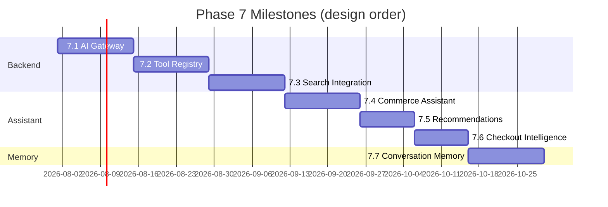

# YEBO AI — Implementation Roadmap

**Design tag:** `yebo-ai-design-v1`  
**Baseline:** `platform-pre-ai-v1`  
**Status:** DESIGN FROZEN — implementation not started

Related: [YEBO_AI_ARCHITECTURE.md](./YEBO_AI_ARCHITECTURE.md)

---

## Phase 7 Overview

Phase 7 delivers YEBO AI as a **backend orchestration layer** with **existing frontend UI** wired to a gateway. Each sub-milestone is independently implementable, testable, and taggable.

**Rule:** No milestone modifies frozen platform business logic.

---

## Milestone Map



---

## 7.1 — AI Gateway

**Tag target:** `yebo-ai-gateway-v1`

| Deliverable | Detail |
|-------------|--------|
| `marketplace/ai/` module scaffold | AIPlatform, AIGateway, AIConfiguration, AIHealth |
| `controller/ai.js` | Thin adapter |
| Routes | `POST /api/v2/ai/chat`, health endpoint |
| Provider | AIProviderManager with mock provider only |
| Prompt | AIPromptRegistry with system + safety + fallback v1.0.0 |
| Security | Rate limit middleware, input validation |
| Tests | Gateway contract tests, architecture verify |
| Frontend | YIPProvider → gateway client (remove browser keys) |

**Freeze criteria:** Gateway responds with mock LLM; no frozen module changes; keys not in frontend bundle.

---

## 7.2 — Tool Registry

**Tag target:** `yebo-ai-tools-v1`

| Deliverable | Detail |
|-------------|--------|
| `AIToolRegistry` | Registration, permissions, schema validation |
| `AIPlanner` | Intent classification (rule-based initially) |
| Tools | SearchTool, CatalogTool, VendorTool (read-only) |
| Prompts | tool@1.0.0, search@1.0.0 |
| Tests | Per-tool contract tests, no direct DB imports |
| Observability | AIMetrics tool call recording |

**Freeze criteria:** Tools call SearchPlatform/CatalogPlatform/VendorPlatform only; architecture test passes.

---

## 7.3 — Search Integration

**Tag target:** `yebo-ai-search-v1`

| Deliverable | Detail |
|-------------|--------|
| `POST /api/v2/ai/search` | NL → SearchTool → optional LLM enrich |
| Frontend | `AISearchNatural` wired to gateway |
| Remove | `YIPShoppingIntelligence.smartSearch` production path |
| Hooks | SearchHooks.afterProductSearch AI context logging |
| Live provider | OpenRouter primary (server-side key) |

**Freeze criteria:** Server search is single source; mock client search deprecated; verify:ai-search passes.

---

## 7.4 — Commerce Assistant

**Tag target:** `yebo-ai-assistant-v1`

| Deliverable | Detail |
|-------------|--------|
| Full chat pipeline | Planner → tools → LLM → formatter |
| `GlobalAIFab` / `AIPanel` | SSE streaming via gateway |
| Prompts | commerce@1.0.0 |
| Tools | KnowledgeTool, CatalogTool enrichment |
| Providers | OpenRouter + Gemini failover |

**Freeze criteria:** End-to-end assistant with tool-backed answers; streaming + cancel works.

---

## 7.5 — Recommendations

**Tag target:** `yebo-ai-recommend-v1`

| Deliverable | Detail |
|-------------|--------|
| `RecommendationTool` | Platform-composed rankings |
| `POST /api/v2/ai/recommend` | Contextual recs |
| Frontend | `MarketplaceAISection`, `HomeAIPicks` wired |
| Prompts | recommendation@1.0.0 |
| Deprecate | Mock intelligence/decision engines in UI path |

**Freeze criteria:** Recommendations cite real product IDs from SearchTool/CatalogTool.

---

## 7.6 — Checkout Intelligence

**Tag target:** `yebo-ai-checkout-v1`

| Deliverable | Detail |
|-------------|--------|
| Checkout scope | Chat context includes cart summary (client-provided, server-validated) |
| Tools | OrderTool (read), PaymentTool (readiness) |
| Frontend | `YEBOCheckoutIntelligence` wired |
| Security | No payment mutations; readiness info only |

**Freeze criteria:** Checkout AI never initiates payment; ownership checks on order reads.

---

## 7.7 — Conversation Memory

**Tag target:** `yebo-ai-memory-v1`

| Deliverable | Detail |
|-------------|--------|
| `AIConversation` | Server-side session store (TTL) |
| Memory scopes | Session, commerce context, preferences (opt-in) |
| Frontend | Slim client memory cache; server authoritative |
| Observability | Full tracing, cost tracking, conversation audit |
| Providers | Full failover chain (OpenRouter, Gemini, OpenAI, Anthropic, Groq) |

**Freeze criteria:** Session persists across page reloads; PII redaction verified; abuse limits active.

---

## Memory Design (Part 7 — no implementation)

| Memory type | Scope | Storage | TTL |
|-------------|-------|---------|-----|
| **Session memory** | Current conversation turns | Server `AIConversation` | 24h |
| **Conversation history** | Past turn summaries | Server, user-bound | 30 days |
| **Commerce context** | Active scope (browse/search/cart/checkout) | Session metadata | Session |
| **Current cart** | Cart item IDs + quantities | Client sends snapshot; server validates IDs exist | Per request |
| **Current search** | Last structured search query + filters | Session | Session |
| **Current product** | Viewing product ID | Session | Session |
| **Current order** | Order ID if on order page | Session, auth-checked | Session |
| **User preferences** | Language, region, opt-in personalization | User profile extension (future) | Persistent |

**Rules:**

- Server memory is authoritative — client cache is display-only
- Cart/order context validated against platform on each turn
- No payment instruments in memory
- User can clear session via `DELETE /api/v2/ai/session/:id`

---

## Observability Design (Part 9)

| Signal | Component | Export |
|--------|-----------|--------|
| **Tracing** | Correlation ID from gateway through tools to provider | Structured logs |
| **Metrics** | `AIMetrics` — requests, latency p50/p99, tool success rate | Health + admin endpoint |
| **Provider failures** | `AIProviderManager` failover events | Audit log |
| **Tool failures** | `AIToolRegistry` execution errors | Audit log + metrics |
| **Conversation logs** | Turn metadata (no PII) | Audit pipeline |
| **Cost tracking** | Token usage × rate | `AIMetrics.getCostSummary()` |
| **Health** | `GET /api/v2/marketplace/ai/health` | Existing health probe pattern |

Verification script (future): `verify:yebo-ai` runs gateway + tool contract + architecture tests per milestone.

---

## Frontend Integration Plan (Part 10)

**Do NOT redesign UI.** Map existing components:

| Component | Current | Target |
|-----------|---------|--------|
| `GlobalAIFab` | Opens local YIPProvider panel | Same — panel calls gateway |
| `AIPanel` | Local `sendMessage()` → provider SDK | `YIPGatewayClient.chat()` SSE |
| `AISearchNatural` | `runSmartSearch()` mock | `YIPGatewayClient.search()` |
| `MarketplaceAISection` | Static Redux slices | `YIPGatewayClient.recommend()` |
| `YEBOCheckoutIntelligence` | Mock hints | Gateway chat with checkout scope |
| `HomeAIExperience` | Marketing / mock | Gateway recommend or static until 7.5 |
| `YIPProvider` | 8+ engine init | Slim: gateway client + UI state only |

**Remove duplicate flows:**

| Remove | Keep |
|--------|------|
| Browser OpenRouter/Gemini calls | Gateway HTTP |
| `YIPShoppingIntelligence` in production path | SearchTool via gateway |
| Mock recommendation engines in UI | RecommendationTool |
| `REACT_APP_*` provider keys | Backend env keys |
| Archived UI AI routes | App.js production shells only |

**New frontend module (design):** `src/ai/gateway/YIPGatewayClient.js` — sole AI HTTP client.

---

## Conversation Lifecycle (Part 6)

```
User Message
    ↓
AIGateway (auth, rate limit, validate)
    ↓
AIConversation (load session + context)
    ↓
AIPlanner (intent + tool selection)
    ↓
AIToolRegistry (platform calls)  ←── business data
    ↓
AIPromptRegistry (compose prompts)
    ↓
AIProviderManager (LLM — optional for tool-only responses)
    ↓
Response Formatter (structure for frontend)
    ↓
AIHooks + AIMetrics (observability)
    ↓
Frontend (AIPanel / AISearchNatural / etc.)
```

Supports: **streaming** (SSE), **cancellation** (AbortSignal), **retry** (idempotent turn ID), **timeout** (30s), **fallback** (tool-only + fallback prompt).

---

## Dependency Graph

```
7.1 Gateway
  └── 7.2 Tools
        └── 7.3 Search
              └── 7.4 Assistant
                    ├── 7.5 Recommendations
                    └── 7.6 Checkout
                          └── 7.7 Memory
```

Each tag is a restore point. Do not skip milestones.

---

## Out of Scope (Phase 7)

- Vector / semantic search
- Autonomous order creation or payment
- Voice input (`ai-voice` flag)
- Virtual try-on (`ai-tryon` flag)
- AI billing / credits (commerce engine)
- Admin/vendor parallel UI stacks
- Fine-tuning or custom models

Deferred to Phase 8+.

---

## Verification Per Milestone

| Milestone | Verify command (future) |
|-----------|-------------------------|
| 7.1 | `verify:yebo-ai-gateway` |
| 7.2 | `verify:yebo-ai-tools` |
| 7.3 | `verify:yebo-ai-search` |
| 7.4 | `verify:yebo-ai-assistant` |
| 7.5 | `verify:yebo-ai-recommend` |
| 7.6 | `verify:yebo-ai-checkout` |
| 7.7 | `verify:yebo-ai` (full) |

All must pass `verify:platform-pre-ai` — frozen modules unchanged.
