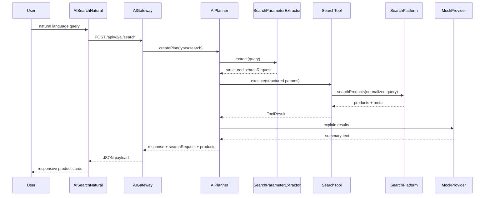

# YEBO AI — Natural Language Search (Phase 7.3)

**Tag:** `yebo-ai-search-v1`  
**Baseline:** `yebo-ai-tools-v1`  
**Module:** `marketplace/ai/search/SearchParameterExtractor.js`

Related: [AI_TOOLS.md](./AI_TOOLS.md) · [AI_GATEWAY.md](./AI_GATEWAY.md) · [YEBO_AI_ARCHITECTURE.md](./YEBO_AI_ARCHITECTURE.md)

---

## Objective

Convert marketplace natural language queries into structured SearchTool parameters, then delegate all filtering to SearchPlatform.

Examples:

- `Show me Samsung phones under 300000 RWF`
- `Find black Nike shoes size 42`
- `Nshakira laptop ya Dell ifite RAM 16GB`
- `Mfasha kubona TV nziza iri munsi ya 500,000`

---

## Natural Language Flow



**Rule:** Planner understands. SearchPlatform searches. SearchTool delegates. Provider explains.

---

## Planner Extraction Rules

`SearchParameterExtractor` applies deterministic rules (no LLM, no embeddings):

| Signal | Examples | Output field |
|--------|----------|--------------|
| Keyword | remaining product terms | `q` |
| Category | phone, laptop, shoes, TV | `category` |
| Brand | Samsung, Nike, `ya Dell` | `brand` |
| Max price | under/below/munsi ya | `maxPrice` |
| Min price | over/above/hejuru ya | `minPrice` |
| Condition | new, used, nshya | `condition` |
| Location | in Kigali, mu … | `location` |
| Availability | in stock, birahari | `inStock` |
| Sort | cheapest, newest, best rated | `sort` |
| Pagination | optional request overrides | `page`, `limit` |
| Language | EN/RW/mixed heuristics | `language` |

Empty queries → `EMPTY_QUERY` (400). Queries with no searchable terms → `INVALID_QUERY` (400).

---

## Search Request Schema

Planner attaches `searchRequest` to gateway responses:

```json
{
  "q": "black size 42",
  "category": "shoes",
  "brand": "Nike",
  "minPrice": null,
  "maxPrice": null,
  "priceMin": null,
  "priceMax": null,
  "condition": null,
  "location": null,
  "inStock": null,
  "sort": "newest",
  "page": 1,
  "limit": 20,
  "language": "en",
  "originalQuery": "Find black Nike shoes size 42",
  "extracted": {
    "language": "en",
    "signals": ["brand:Nike", "category:shoes"]
  }
}
```

---

## Search Response Schema

Gateway search response (`POST /api/v2/ai/search`):

```json
{
  "success": true,
  "data": {
    "intent": "search",
    "toolId": "search.products",
    "searchRequest": { "...": "..." },
    "tool": {
      "success": true,
      "tool": "search.products",
      "version": "7.3.0",
      "latency": 42,
      "data": {
        "products": [],
        "meta": {
          "page": 1,
          "limit": 20,
          "total": 0,
          "count": 0,
          "empty": true
        }
      },
      "metadata": { "correlationId": "uuid" },
      "error": null
    },
    "message": "YEBO gateway mock response...",
    "meta": {
      "phase": "7.3",
      "naturalLanguageSearch": true
    }
  }
}
```

---

## Frontend Integration

No UI redesign. Existing components reused:

- `AISearchNatural` — query input + examples
- `YIPProvider.runSmartSearch` — calls gateway, maps `tool.data.products`
- `YEBOSmartSearchResults` — renders SearchPlatform products + parsed filters

Responsive layout unchanged for desktop, tablet, and mobile web.

---

## Verification

```bash
npm run test:ai-search
npm run verify:yebo-ai-search
```

Tests cover English, Kinyarwanda, mixed language, price/brand/category extraction, SearchPlatform delegation, and empty/invalid query handling.

---

## Out of Scope (Phase 7.3)

Semantic search, embeddings, vector DB, live LLM providers, recommendations, memory, checkout intelligence, voice, and vision remain deferred.
