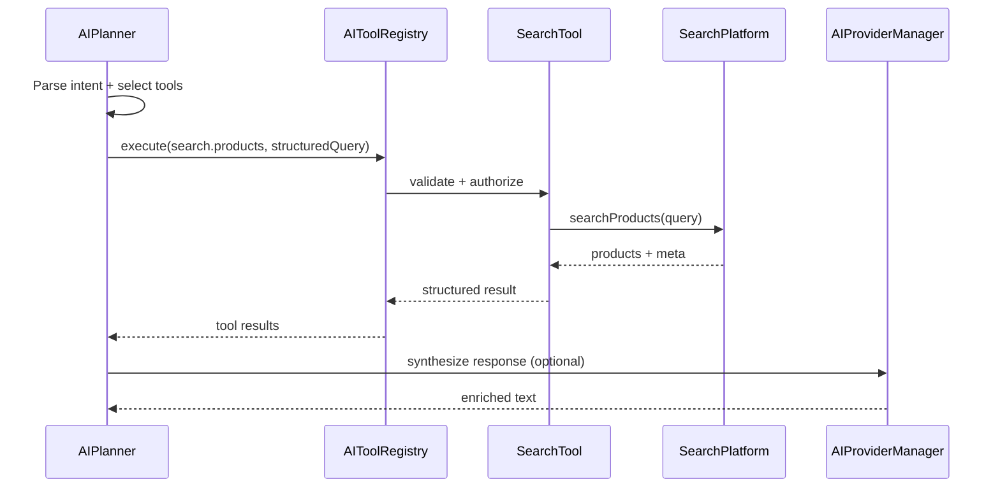

# YEBO AI — Tool Architecture

**Tag:** `yebo-ai-memory-v1`  
**Baseline:** `yebo-ai-tools-v1`  
**Status:** IMPLEMENTED — YEBO AI v1 complete (Phases 7.2–7.7)

Related: [YEBO_AI_ARCHITECTURE.md](./YEBO_AI_ARCHITECTURE.md) · [AI_TOOL_CONTRACTS.md](./AI_TOOL_CONTRACTS.md) · [AI_SEARCH.md](./AI_SEARCH.md) · [AI_RECOMMENDATIONS.md](./AI_RECOMMENDATIONS.md) · [AI_CHECKOUT_INTELLIGENCE.md](./AI_CHECKOUT_INTELLIGENCE.md) · [AI_CONVERSATION_MEMORY.md](./AI_CONVERSATION_MEMORY.md) · [AI_SECURITY.md](./AI_SECURITY.md)

---

## Principles

1. **Tools are the only way AI touches business data**
2. Every tool calls a **frozen Platform** or **Shared Service** public method
3. **Never:** MongoDB models, controllers, duplicated validation, direct provider SDK for commerce ops
4. Tools return **structured JSON** — LLM receives summaries, not raw DB documents
5. Tools are **registered** in `AIToolRegistry` — not ad-hoc functions in planner

---

## Tool Interface (Phase 7.2 contract)

```javascript
{
  id: "search.products",
  name: "SearchTool",
  version: "7.2.0",
  capabilities: ["keyword", "category", "filters", "pagination"],
  permissions: ["public"],
  platform: "SearchPlatform",
  initialize() {},
  health() {},
  capabilities() {},
  execute(input, context) {},
  metadata() {},
  run(input, context) // → ToolResult
}
```

---

## Tool Registry

`AIToolRegistry` responsibilities:

- Register / unregister tools at bootstrap
- Validate input against schema before execution
- Check `permissions` against `context.user` and `context.scope`
- Emit `AIHooks.afterTool` with redacted payload
- Record metrics via `AIMetrics.recordToolCall()`

---

## Core Tools

### SearchTool

| Field | Value |
|-------|-------|
| **ID** | `search.products` |
| **Platform** | `SearchPlatform` |
| **Methods** | `searchProducts(query)`, `searchShops(query)`, `suggest(query)` |
| **Input** | `{ q, category, sort, page, limit, filters... }` (structured — planner extracts from NL) |
| **Output** | `{ products[], meta: { count, page, empty }, query }` |
| **Never** | Direct `Product.find()`, regex building, `SearchValidation` duplication |

**NL flow:** Planner extracts intent → SearchTool with structured params → optional LLM enriches result summaries.

Also: `search.suggestions` → `SearchPlatform.suggest()`.

---

### CatalogTool

| Field | Value |
|-------|-------|
| **ID** | `catalog.product.get`, `catalog.product.listByShop`, `catalog.categories` |
| **Platform** | `ProductPlatform` / `ProductService` |
| **Methods** | `catalog.getById()`, `catalog.listByShop()`, category normalization |
| **Permissions** | `public` for reads; writes not exposed to AI in Phase 7 |
| **Never** | `ProductPlatform.createProduct()` without human seller flow |

---

### VendorTool

| Field | Value |
|-------|-------|
| **ID** | `vendor.shop.get`, `vendor.shop.list` |
| **Platform** | `VendorPlatform` / `ShopService` |
| **Methods** | `findById()`, shop profile reads |
| **Permissions** | `public` for shop pages; seller scope for own shop |
| **Never** | Shop registration or mutation |

---

### OrderTool

| Field | Value |
|-------|-------|
| **ID** | `order.get`, `order.listForUser`, `order.status` |
| **Platform** | `OrderPlatform` / `OrderService` |
| **Methods** | Read-only in Phase 7: `findById()`, `listForUser()`, `OrderStatus.getSummary()` |
| **Permissions** | `authenticated` + ownership check |
| **Never** | Create, update, refund, inventory — requires explicit user confirmation flow (Phase 7.6+) |

Mutations deferred to Phase 8+ with human-in-the-loop confirmation tool.

---

### PaymentTool

| Field | Value |
|-------|-------|
| **ID** | `payment.readiness`, `payment.session.status` |
| **Platform** | `PaymentIntegrationHook`, payment facade delegate |
| **Methods** | Readiness probes, session status — **no charges** |
| **Permissions** | `authenticated` |
| **Never** | Direct provider SDK, ledger writes, refund execution |

---

### RecommendationTool

| Field | Value |
|-------|-------|
| **ID** | `recommend.contextual` |
| **Platform** | `SearchTool` + `CatalogTool` + `RecommendationEngine` |
| **Logic** | Deterministic ranking of current search/catalog results; MockProvider explains reasons |
| **Input** | `{ action: "rank", sourceProducts?, searchRequest?, preferAffordable?, limit }` |
| **Output** | `{ recommendations[{ rank, product, searchPreview, reasons[], signals }], meta }` |
| **Reuse** | Session `currentProducts` / prior SearchTool results before new search |
| **Never** | ML scores, invented attributes, direct DB access |

See [AI_RECOMMENDATIONS.md](./AI_RECOMMENDATIONS.md).

---

### CheckoutTool

| Field | Value |
|-------|-------|
| **ID** | `checkout.guide` |
| **Platform** | `CatalogTool` + `CheckoutIntelligenceEngine` |
| **Logic** | Read-only purchase guidance, comparisons, availability checks |
| **Input** | `{ action: "guide", sourceProducts?, message, mode? }` |
| **Output** | `{ guidance[], comparisons[], availability, meta }` |
| **Reuse** | Session search/recommendation products before new tool calls |
| **Never** | Order creation, payment execution, inventory modification |

See [AI_CHECKOUT_INTELLIGENCE.md](./AI_CHECKOUT_INTELLIGENCE.md).

---

## Conversation Memory (Phase 7.7)

Session-scoped reference resolution via `ConversationMemoryEngine` — not a tool, but orchestration consumed by the planner.

| Capability | Implementation |
|------------|----------------|
| Reference resolution | `it`, ordinals, `cheaper one`, `the vendor` |
| Entity tracking | Search, products, recommendation, comparison, checkout |
| Lifetime | Session TTL only — no persistence |

See [AI_CONVERSATION_MEMORY.md](./AI_CONVERSATION_MEMORY.md).

Replaces: `YIPShoppingIntelligence`, `YEBOIntelligenceEngine` mock paths.

---

### KnowledgeTool

| Field | Value |
|-------|-------|
| **ID** | `knowledge.faq`, `knowledge.policy`, `knowledge.productContext` |
| **Platform** | Static knowledge base + `CatalogTool` / `SearchTool` for live data |
| **Source** | Versioned FAQ/policy documents in `marketplace/ai/prompts/knowledge/` |
| **Never** | Hallucinated policy — FAQ answers must cite registered knowledge entries |

Replaces: `KnowledgeEngine` + `MockKnowledge.js`.

---

## Tool Execution Graph



---

## Tool Authorization Matrix

| Tool | Anonymous | Customer | Seller | Admin |
|------|-----------|----------|--------|-------|
| `search.*` | ✔ | ✔ | ✔ | ✔ |
| `catalog.product.get` | ✔ | ✔ | ✔ | ✔ |
| `vendor.shop.get` | ✔ | ✔ | ✔ | ✔ |
| `order.listForUser` | ✗ | ✔ own | ✔ own shop orders | ✔ |
| `payment.readiness` | ✗ | ✔ | ✔ | ✔ |
| `recommend.*` | limited | ✔ | ✔ | ✔ |
| `knowledge.*` | ✔ | ✔ | ✔ | ✔ |

---

## Deprecation Map (frontend → backend tools)

| Frontend (deprecated) | Backend tool |
|--------------------|--------------|
| `YIPShoppingIntelligence.smartSearch` | `search.products` + LLM enrich |
| `runSmartSearch()` in YIPProvider | Gateway `POST /api/v2/ai/search` |
| `getRankedRecommendations()` | `recommend.contextual` |
| `searchKnowledge()` mock | `knowledge.*` + `catalog.product.get` |
| `executeAgent()` mock | `AIPlanner` + tool graph |

---

## Testing Strategy (design)

Each tool gets contract tests:

- Input schema rejection
- Permission denial
- Platform method called (mock platform injection)
- No direct model imports in tool files
- Output schema compliance

Architecture test: `verify:ai-tools` — tools must not import `mongoose`, `controller/`, or frozen platform internals beyond public Platform API.
