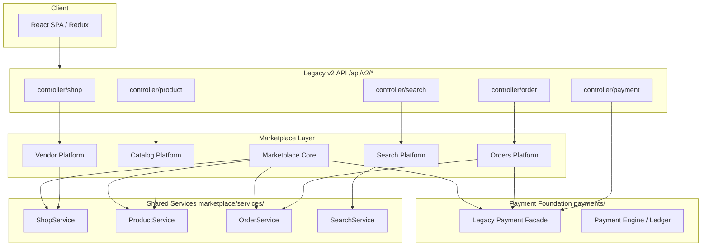
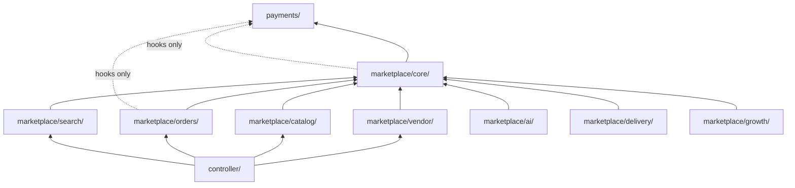
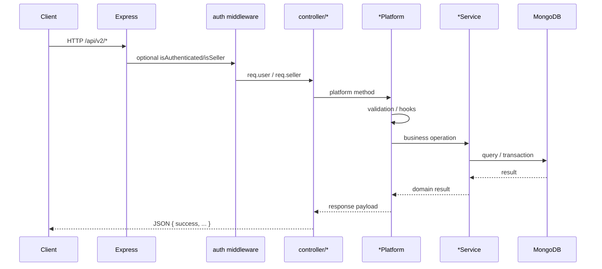
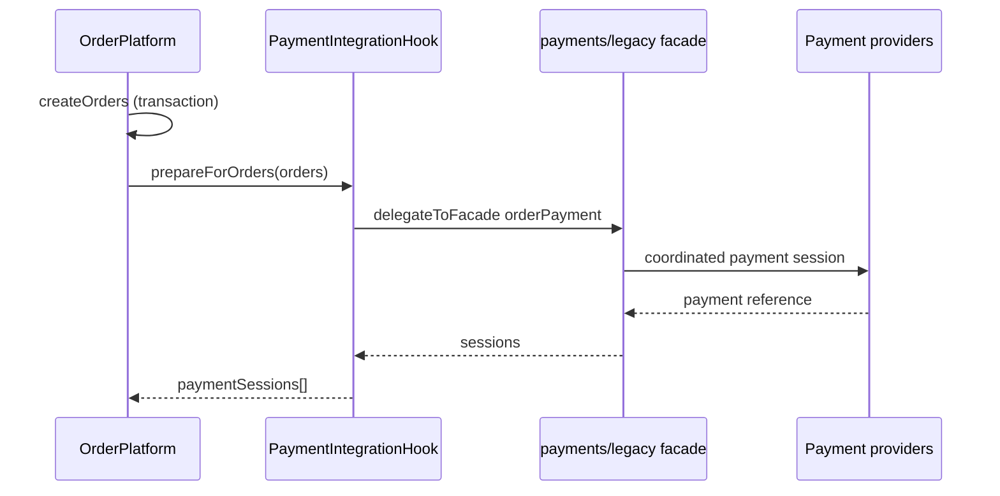
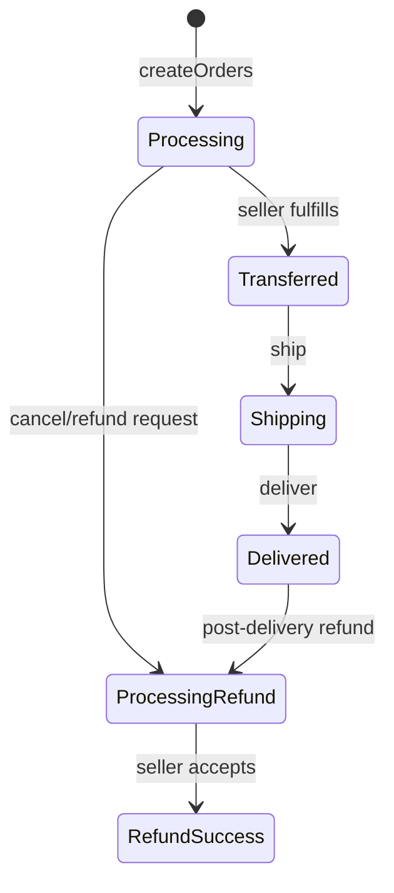
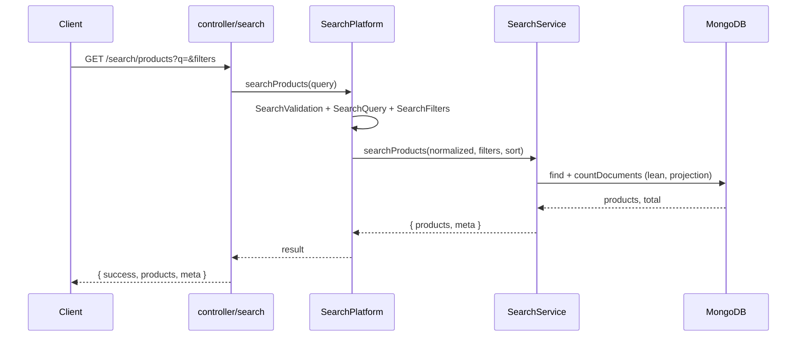
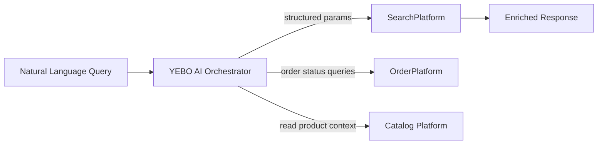

# Yebone Platform Architecture

**Status:** Frozen at `platform-pre-ai-v1`  
**Baseline:** `search-production-v1`  
**Checkpoint branch:** `feature/platform-freeze-checkpoint`

This is the canonical backend platform architecture document. It describes module boundaries, allowed communication, and integration flows for all frozen foundation layers.

Related documents:

- [PROJECT_STATUS.md](./PROJECT_STATUS.md)
- [DEVELOPMENT_ROADMAP.md](./DEVELOPMENT_ROADMAP.md)
- [FRONTEND_ARCHITECTURE.md](./FRONTEND_ARCHITECTURE.md)
- [SEARCH.md](./SEARCH.md)
- [YEBO_AI_INTEGRATION_GUIDE.md](./YEBO_AI_INTEGRATION_GUIDE.md)
- [../CHANGELOG.md](../CHANGELOG.md)

---

## Overall Platform Architecture

Yebone is a layered marketplace platform:

1. **Payment Foundation** (`payments/`) — financial infrastructure, provider orchestration, legacy facade
2. **Marketplace Core** (`marketplace/core/`) — composition, hooks, shared services registry
3. **Domain Platforms** — vendor, catalog, search, orders (each with Platform + Service)
4. **Legacy v2 Controllers** (`controller/`) — thin HTTP adapters preserving public API routes
5. **Frontend SPA** — React + Redux consuming v2 APIs (see `FRONTEND_ARCHITECTURE.md`)

---

## Module Boundaries

| Module | Path | Composition Root | Business Service | Frozen Tag |
|--------|------|------------------|----------------|------------|
| Payment Foundation | `payments/` | `PaymentModule` | Internal engines | `payment-foundation-v10` |
| Marketplace Core | `marketplace/core/` | `MarketplaceCore` | Service registry | `marketplace-core-v1` |
| Vendor Platform | `marketplace/vendor/` | `VendorPlatform` | `ShopService` | `vendor-management-v1` |
| Product Catalog | `marketplace/catalog/` | `ProductPlatform` | `ProductService` | `product-catalog-v1` |
| Orders | `marketplace/orders/` | `OrderPlatform` | `OrderService` | `orders-production-v1` |
| Search | `marketplace/search/` | `SearchPlatform` | `SearchService` | `search-production-v1` |
| YEBO AI | `marketplace/ai/` | `AIPlatform` | Tool orchestration | `yebo-ai-memory-v1` |
| Delivery | `marketplace/delivery/` | `DeliveryPlatform` + `CourierPlatform` + `DeliveryConfigurationPlatform` | Persistent config + couriers | `delivery-configuration-v1` |
| Growth | `marketplace/growth/` | `GrowthPlatform` + `GrowthConfigurationPlatform` | Referral, coupons, commission orchestration | `platform-integration-v1` |
| Integration | `marketplace/integration/` | `PlatformIntegration` | Cross-platform bridges, audit, RBAC, flags | `platform-integration-v1` |

---

## Dependency Graph

**Allowed direction:** upper layers depend on lower layers. Payment never depends on marketplace.

---

## Allowed Module Communication

| From | To | Mechanism |
|------|-----|-----------|
| Controllers | Platform roots | `getVendorPlatform()`, `getOrderPlatform()`, etc. |
| Platforms | Shared services | `marketplaceCore.services.*` |
| Orders Platform | Payment | `PaymentIntegrationHook` → legacy facade delegate |
| Marketplace Core | Payment | `hooks.payment.prepareForOrders()` |
| Search Platform | Catalog prep | Read-only `ProductSearch.prepareFilters()` |
| Any layer | MongoDB models | Via service layer only |

---

## Forbidden Dependencies

| Forbidden | Reason |
|-----------|--------|
| `payments/` importing `marketplace/` | Financial core must stay independent |
| Controllers containing business logic | Violates thin adapter pattern |
| Platforms bypassing their Service | Duplicates business rules |
| Direct provider SDK in controllers | Must use payment facade |
| AI (future) querying Mongo directly | Must orchestrate frozen platforms |
| Modifying frozen module internals | Requires explicit unfreeze tag |

---

## Composition Roots

Registration order in `marketplace/index.js`:

1. `registerMarketplaceCore(app)`
2. `registerVendorPlatform(app, core)`
3. `registerProductPlatform(app, core)`
4. `registerSearchPlatform(app, core)`
5. `registerOrderPlatform(app, core)`
6. `registerGrowthPlatform(app)`
7. `registerAIPlatform(app, core)`
8. `registerDeliveryConfigurationPlatform(app)`
9. `registerDeliveryPlatform(app, core)`
10. `registerCourierPlatform(app, core)`

Each platform exposes:

- `create*Platform()` / `get*Platform()`
- Health route under `/api/v2/marketplace/{module}/health`

---

## Shared Services

Located in `marketplace/services/`:

| Service | Responsibility |
|---------|----------------|
| `ShopService` | Vendor shop CRUD, auth helpers |
| `ProductService` | Product CRUD, reviews, likes |
| `OrderService` | Order creation, status, refunds, inventory |
| `SearchService` | Product/shop query execution |
| `CommissionService` | Referral commission helpers |
| `UploadService` | Media upload (Cloudinary) |

Platforms orchestrate; services execute business rules and persistence.

---

## Request Lifecycle

---

## Authentication Flow

- Customer: JWT in cookie `token` or `Authorization: Bearer`
- Seller: JWT in cookie `seller_token` or Bearer
- Middleware: `middleware/auth.js` — `isAuthenticated`, `isSeller`, `isAdmin`
- Controllers enforce ownership via platform/security helpers (orders, search rate limits)

---

## Payment Flow

Payment sessions are created after order DB transaction commits (compensation on failure).

---

## Order Flow

State machine: `OrderStateMachine` in orders platform. Inventory reserved at create time.

---

## Search Flow

---

## Future YEBO AI Integration

YEBO AI orchestrates existing platforms — see [YEBO_AI_INTEGRATION_GUIDE.md](./YEBO_AI_INTEGRATION_GUIDE.md).

AI must **not** bypass services or duplicate business logic.

---

## Delivery Platform (Phase 8.0–8.3)

Delivery is implemented at `marketplace/delivery/` — independent of Orders business logic.

- **8.0 Foundation:** lifecycle, tracking numbers, structured addresses
- **8.1 Tracking:** append-only timeline and status visibility
- **8.2 Courier Management:** courier registry, availability, capacity, assignment bridge
- **8.3 Configuration:** Super Admin feature flags, persistent settings, route guards, audit log

See [DELIVERY_MODULE.md](./DELIVERY_MODULE.md), [DELIVERY_TRACKING.md](./DELIVERY_TRACKING.md), [COURIER_MANAGEMENT.md](./COURIER_MANAGEMENT.md), and [DELIVERY_CONFIGURATION.md](./DELIVERY_CONFIGURATION.md).

**Delivery MVP frozen at `delivery-configuration-v1`.**

---

## Growth Platform (Phase 9.0)

Growth is implemented at `marketplace/growth/` — orchestrates referral, affiliate, coupons, promotions, commission rules, and reward ledger without duplicating Payments commission math.

- **9.0 MVP:** configuration, feature flags, signed attribution, coupon/promotion validation, commission orchestration, reward ledger, legacy adapters

See [GROWTH_PLATFORM.md](./GROWTH_PLATFORM.md).

**Platform Integration frozen at `platform-integration-v1`.**

---

## Future Delivery Pricing Integration

Delivery pricing (post-MVP) will extend delivery without modifying frozen foundation/tracking/courier/configuration cores:

- Persistent storage migration
- Order lifecycle compatibility hooks
- No changes to payment or catalog frozen modules

---

## Platform Layering Summary

| Layer | Responsibility | Modify after freeze? |
|-------|----------------|----------------------|
| L0 Payment | Money movement, ledger | No |
| L1 Core | Registry, hooks, health | No |
| L2 Domain Platforms | Orchestration per domain | No |
| L3 Services | Business logic + DB | No |
| L4 Controllers | HTTP adapters | Compatibility only |
| L5 Frontend | UI + Redux | Architecture frozen |

**Foundation complete at `platform-pre-ai-v1`. Phase 7 (YEBO AI) may begin only after this checkpoint.**
