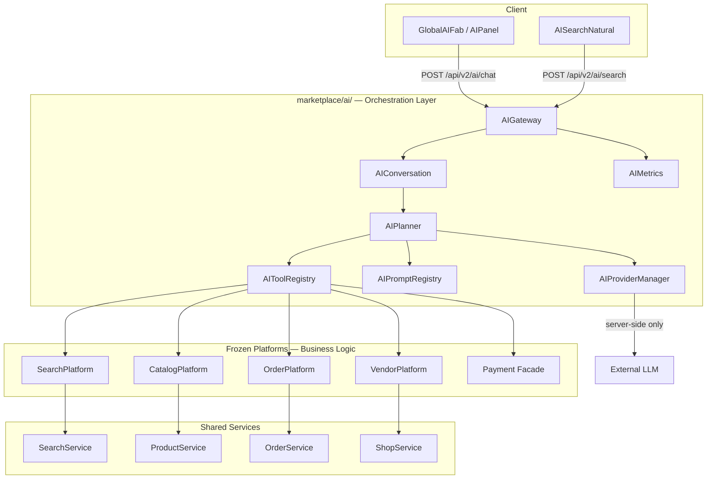

# YEBO AI — Canonical Architecture

**Tags:** `yebo-ai-design-v1` · `yebo-ai-gateway-v1` · `yebo-ai-tools-v1` · `yebo-ai-search-v1` · `yebo-ai-assistant-v1` · `yebo-ai-recommend-v1` · `yebo-ai-checkout-v1` · `yebo-ai-memory-v1` · `yebo-ai-commerce-agent-v1`  
**Baseline:** `platform-pre-ai-v1`  
**Branch:** `feature/yebo-ai-commerce-agent`  
**Status:** Phase 13 Commerce Agent implemented — YEBO AI commerce writes frozen at `yebo-ai-commerce-agent-v1`

> YEBO AI is an **orchestration layer**. It is not a business platform. All business logic remains in frozen modules.

Related: [AI_TOOLS.md](./AI_TOOLS.md) · [PROMPT_ARCHITECTURE.md](./PROMPT_ARCHITECTURE.md) · [AI_PROVIDER_ARCHITECTURE.md](./AI_PROVIDER_ARCHITECTURE.md) · [AI_SECURITY.md](./AI_SECURITY.md) · [AI_ROADMAP.md](./AI_ROADMAP.md) · [YEBO_AI_INTEGRATION_GUIDE.md](./YEBO_AI_INTEGRATION_GUIDE.md) · [AI_COMMERCE_AGENT.md](./AI_COMMERCE_AGENT.md)

---

## Primary Principle

```
User / Frontend
      ↓
  AIPlatform (orchestration only)
      ↓
  Frozen Platforms (Search, Catalog, Vendor, Orders, Payment)
      ↓
  Shared Services (SearchService, ProductService, OrderService, ShopService)
```

YEBO AI may **call** platform public APIs and Platform classes. It may **never** bypass Services, touch MongoDB directly, duplicate validation, or embed business rules.

---

## Part 1 — Platform Audit & Classification

Audit scope: backend `platform-pre-ai-v1` + frontend YIP stack. Full findings documented in pre-Phase audit (`feature/yebo-ai-audit`).

### Backend

| Component | Path | Decision | Why |
|-----------|------|----------|-----|
| `AiHookRegistry` | `marketplace/hooks/AiHookRegistry.js` | **UPGRADE** | Correct extension point; wire to new `AIHooks` in Phase 7.1 |
| `SearchHooks` | `marketplace/search/SearchHooks.js` | **KEEP** | Post-search metadata for AI context; no logic change |
| `SearchConfiguration.aiSearchReady` | `marketplace/search/` | **KEEP** | Readiness flag for health + suggestions |
| `MarketplaceFeatureRegistry.ai` | `marketplace/core/` | **UPGRADE** | Stale flag; enable when AI platform ships (config only) |
| User messaging controllers | `controller/conversation.js` | **KEEP** | Not AI — seller chat; do not merge |
| `YEBO_AI_INTEGRATION_GUIDE.md` | `docs/` | **KEEP** | Binding rules; superseded in detail by this doc |

### Frontend YIP — Core

| Component | Path | Decision | Why |
|-----------|------|----------|-----|
| `YIPProvider` | `src/ai/core/YIPProvider.jsx` | **UPGRADE** | Slim to gateway client; remove mock engines from init |
| `GlobalAIFab` + `AIPanel` | `src/components/ai/` | **KEEP** | Production UX entry — no redesign |
| `ConversationPipeline` | `src/ai/conversation/` | **MERGE** | Merge orchestration into backend planner; frontend becomes thin stream client |
| `ProviderFactory` / OpenRouter / Gemini clients | `src/ai/providers/` | **DEPRECATE** (client keys) | Replace with backend `AIProviderManager`; remove browser keys |
| `OpenAIAdapter`, `ClaudeAdapter`, `GeminiAdapter` (legacy) | `src/ai/providers/` | **REMOVE** | Superseded by backend provider abstraction |
| `AIOrchestrator` (mock) | `src/ai/orchestration/` | **MERGE** | Absorbed into backend `AIPlanner` |
| `YIPShoppingIntelligence` | `src/ai/intelligence/` | **DEPRECATE** | Replace with `SearchTool` + LLM enrichment |
| `YEBOIntelligenceEngine` | `src/ai/intelligence/` | **MERGE** | Into backend `RecommendationTool` |
| `DecisionEngine` | `src/ai/decision/` | **MERGE** | Into backend `AIPlanner` scoring |
| `KnowledgeEngine` + mocks | `src/ai/knowledge/` | **UPGRADE** | Replace mock with `KnowledgeTool` → catalog/search |
| `AgentPlatform` + `MockAgents` | `src/ai/agents/` | **DEPRECATE** | Replaced by `AIToolRegistry` + `AIPlanner` |
| `CommerceEngine` / credits | `src/ai/commerce/` | **DEPRECATE** | Out of Phase 7 scope; defer billing |
| `YEBOMemoryEngine` (client) | `src/ai/memory/` | **UPGRADE** | Session cache only; authoritative memory on backend |
| `ActionManager` (empty registry) | `src/ai/actions/` | **UPGRADE** | Maps 1:1 to backend `AIToolRegistry` |
| `YIPPromptLibrary` (empty templates) | `src/ai/prompts/` | **UPGRADE** | Migrate to backend `AIPromptRegistry` |
| `AIService.js` (deprecated) | `src/components/ai/core/` | **REMOVE** | Legacy shim |
| `AISearchNatural` | `src/components/ai/sections/` | **UPGRADE** | Wire to gateway search tool flow |
| `MarketplaceAISection` | `src/components/Marketplace/` | **UPGRADE** | Replace static data with gateway recommendations |
| `admin-ui/`, `vendor-ui/`, `ai-experience-ui/` | `src/` | **DEPRECATE** | Archived; not in App.js |
| `useProductSearch` | `src/` (search hook) | **KEEP** | Canonical server search; AI enriches, does not replace |

---

## Part 2 — AI Platform Module Design

**Canonical path (future implementation):** `marketplace/ai/`

This module is **new** — it does not modify frozen platforms. It registers alongside them via `MarketplaceCore`.

### Module Structure (design)

```
marketplace/ai/
├── AIPlatform.js          # Composition root
├── AIGateway.js           # HTTP + auth boundary
├── AIPlanner.js           # Intent → tool plan → LLM synthesis
├── AIToolRegistry.js      # Tool definitions + dispatch
├── AIPromptRegistry.js    # Versioned prompt templates
├── AIConversation.js      # Session + turn lifecycle
├── AIProviderManager.js   # LLM provider abstraction
├── AIConfiguration.js     # Feature flags, limits, defaults
├── AIHealth.js            # Health probe
├── AIHooks.js             # Lifecycle hooks (extends AiHookRegistry)
├── AIMetrics.js           # Metrics + cost tracking
├── tools/                 # Tool implementations (call platforms only)
├── prompts/               # Prompt template files (versioned)
├── middleware/            # Rate limit, auth scope
└── __tests__/             # Architecture + contract tests
```

### Component Responsibilities

| Component | Responsibility | Must NOT |
|-----------|----------------|----------|
| **AIPlatform** | Register with MarketplaceCore; expose health; wire gateway, planner, tools, providers | Contain business logic |
| **AIGateway** | Authenticate requests; validate input; route to conversation; enforce rate limits; return formatted responses | Call MongoDB or controllers |
| **AIPlanner** | Parse intent; select tools; build execution graph; decide LLM vs direct tool response | Duplicate SearchFilters/OrderValidation |
| **AIToolRegistry** | Register tools; validate permissions; dispatch to platform APIs; return structured results | Execute queries directly |
| **AIPromptRegistry** | Load versioned prompts; render with variables; audit prompt version used | Hardcode strings in code |
| **AIConversation** | Session ID; turn history; context snapshot; streaming state; cancellation | Store PII unredacted long-term |
| **AIProviderManager** | Select provider; call LLM; stream tokens; handle failover; track cost | Expose keys to frontend |
| **AIConfiguration** | Provider defaults, model map, timeouts, feature flags, tool enablement | Override frozen platform config |
| **AIHealth** | Report gateway, provider, tool registry readiness | Perform LLM calls on health check |
| **AIHooks** | `beforeTurn`, `afterTool`, `afterResponse` — observability + extensions | Modify platform state |
| **AIMetrics** | Latency, token usage, tool success/failure, cost per session | Block request path |

### Registration Order

```
MarketplaceCore
  → VendorPlatform
  → CatalogPlatform
  → SearchPlatform
  → OrdersPlatform
  → AIPlatform          ← NEW (depends on all above)
```

AIPlatform receives **references** to frozen platforms at composition time — dependency injection only.

---

## System Architecture Diagram



---

## Public API Surface (design)

| Endpoint | Purpose | Auth |
|----------|---------|------|
| `POST /api/v2/ai/chat` | Assistant turn (stream optional) | User JWT |
| `POST /api/v2/ai/search` | NL → structured search + enrichment | Public / user |
| `POST /api/v2/ai/recommend` | Contextual recommendations | User JWT |
| `GET /api/v2/ai/session/:id` | Session metadata (no raw PII) | User JWT |
| `DELETE /api/v2/ai/session/:id` | Cancel / clear session | User JWT |
| `GET /api/v2/marketplace/ai/health` | AI platform health | Public |

Thin controller: `controller/ai.js` → `AIPlatform` only.

---

## Integration with Frozen Platforms

See [YEBO_AI_INTEGRATION_GUIDE.md](./YEBO_AI_INTEGRATION_GUIDE.md). Summary:

| Platform | AI may call | AI must never bypass |
|----------|-------------|----------------------|
| Search | `SearchPlatform.searchProducts()`, suggestions | `SearchService` Mongo queries from AI code |
| Catalog | `ProductPlatform.catalog.getById()` | `ProductValidation` rules |
| Vendor | `ShopService.findById()` | Shop registration logic |
| Orders | `OrderService.findById()`, status reads | `OrderStateMachine`, idempotency |
| Payment | `PaymentIntegrationHook` readiness | Payment facade internals |

---

## Frontend Integration (summary)

Reuse existing YIP UI without redesign. See [AI_ROADMAP.md](./AI_ROADMAP.md) § Frontend.

| UI Component | Backend mapping |
|--------------|-----------------|
| `GlobalAIFab` / `AIPanel` | `POST /api/v2/ai/chat` (SSE stream) |
| `AISearchNatural` | `POST /api/v2/ai/search` |
| `MarketplaceAISection` | `POST /api/v2/ai/recommend` |
| `YEBOCheckoutIntelligence` | `POST /api/v2/ai/chat` with checkout context scope |

Remove: browser-direct OpenRouter/Gemini calls, `YIPShoppingIntelligence` mock path, duplicate Redux-only search in AI flows.

---

## Design Freeze Rules

1. No code in frozen modules (`payments/`, `marketplace/{core,vendor,catalog,orders,search}/`)
2. All new code under `marketplace/ai/` + thin `controller/ai.js`
3. Frontend changes limited to gateway client wiring (separate frontend milestone)
4. Every milestone independently taggable (`yebo-ai-gateway-v1`, etc.)
5. This document is the permanent blueprint for all future AI features

---

## Document Index

| Document | Content |
|----------|---------|
| [AI_TOOLS.md](./AI_TOOLS.md) | Tool registry design |
| [PROMPT_ARCHITECTURE.md](./PROMPT_ARCHITECTURE.md) | Prompt system |
| [AI_PROVIDER_ARCHITECTURE.md](./AI_PROVIDER_ARCHITECTURE.md) | Provider abstraction |
| [AI_SECURITY.md](./AI_SECURITY.md) | Security architecture |
| [AI_ROADMAP.md](./AI_ROADMAP.md) | Implementation milestones |
| [AI_COMMERCE_AGENT.md](./AI_COMMERCE_AGENT.md) | Phase 13 Commerce Agent — confirmation protocol, tools, audit |
