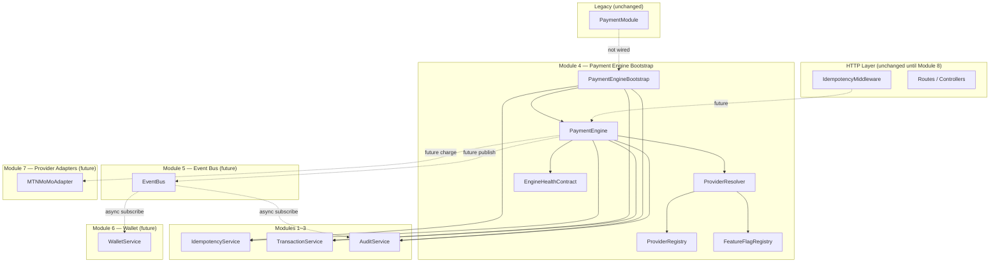

# Payment Foundation Architecture

**Branch:** `feature/payment-foundation`  
**Modules complete:** 1 (Idempotency), 2 (Transactions), 3 (Audit), 4 (Payment Engine Bootstrap)  
**Status:** Module 4 closed — no runtime wiring

---

## Approved Module Roadmap

```
Module 1  Idempotency Layer              ✅ Complete
    ↓
Module 2  Transaction Foundation         ✅ Complete
    ↓
Module 3  Audit Foundation               ✅ Complete
    ↓
Module 4  Payment Engine Bootstrap       ✅ Complete
    ↓
Module 5  Event Bus                      ⏳ Not started
    ↓
Module 6  Wallet                         ⏳ Not started
    ↓
Module 7  Provider Adapters (MTN MoMo+)  ⏳ Not started
    ↓
Module 8  Integration Gate               ⏳ Wire into PaymentModule
```

---

## Module Overview

| Module | Component | Artifact | Wired to PaymentModule |
|--------|-----------|----------|------------------------|
| 1 | Idempotency Layer | `payment_idempotency_keys` | No |
| 2 | Transaction Foundation | `payment_transactions` | No |
| 3 | Audit Foundation | `payment_audit_logs` | No |
| 4 | Payment Engine Bootstrap | `infrastructure/engine/` | No |
| 5 | Event Bus | TBD | No |
| 6 | Wallet | `payment_wallets` (TBD) | No |
| 7 | Provider Adapters | MTN MoMo, etc. | No |
| 8 | Integration Gate | Adapters → PaymentModule | Yes (future) |

---

## Dependency Diagram



---

## How Module 4 Coordinates Foundation Modules

### Idempotency wraps engine operations

```
PaymentEngine.charge(request)
    │
    ▼
IdempotencyService.execute(idempotencyKey, payload, handler, context)
    │
    ├── First call → handler runs
    │       ├── TransactionService.createTransaction()
    │       ├── AuditService.record(PAYMENT_CREATED)
    │       └── ProviderResolver.resolve() — metadata only
    │
    └── Duplicate → cached result replayed (no duplicate transaction)
```

Idempotency is the **outermost guard** for all mutating engine operations.

### Audit remains independent

- `AuditService` is **injected** — never imports engine
- Engine calls `auditService.record()` synchronously on charge
- Future Event Bus subscriber will call audit for **derived** events (wallet credit, settlement)
- Audit never drives business decisions

### How Payment Engine will call providers (Module 7+)

```
PaymentEngine.charge()
    1. IdempotencyService.execute()
    2. TransactionService.createTransaction()
    3. AuditService.record(PAYMENT_CREATED)
    4. ProviderResolver.resolve() → descriptor + adapter reference
    5. adapter.charge(context)          ← Module 7 (not built yet)
    6. TransactionService.transitionStatus()
    7. AuditService.record(PAYMENT_CAPTURED)
    8. EventBus.publish(PaymentCaptured) ← Module 5
```

Module 4 stops at step 4 — adapter invocation is deferred.

### How Event Bus will subscribe (Module 5)

```
PaymentEngine publishes domain event
    → EventBus
    → AuditEventSubscriber (derived audit events)
    → WalletEventSubscriber (Module 6)
    → NotificationSubscriber
```

Event Bus will **never** call back into PaymentEngine.

### How Wallet will integrate (Module 6)

```
PaymentTransactionStatusChanged { status: SETTLED }
    → EventBus (Module 5)
    → WalletService.creditSeller() (Module 6)
    → AuditService via subscriber (WALLET_CREDITED)
```

Wallet subscribes to events — no direct TransactionService calls.

---

## Circular Dependency Prevention

| Rule | Status |
|------|--------|
| Foundation modules do not import Engine | ✅ Verified |
| Engine imports Foundation one direction only | ✅ Verified |
| Audit/Wallet subscribe to events — no reverse calls | ✅ Designed |
| Provider adapters isolated — no mongoose in adapters | ✅ Planned Module 7 |
| PaymentModule unchanged until Integration Gate | ✅ Verified |

---

## Composition Root

```javascript
const { createPaymentEngineBootstrap } = require("./infrastructure/engine");

const bootstrap = createPaymentEngineBootstrap();
// bootstrap.engine.health() → internal readiness
// bootstrap.featureFlags.enable("paymentEngineEnabled") — manual, not auto
```

---

## File Map

```
payments/infrastructure/
├── idempotency/          Module 1 ✅
├── transactions/         Module 2 ✅
├── audit/                Module 3 ✅
├── engine/               Module 4 ✅
│   ├── ENGINE_HEALTH_CONTRACT.md
│   ├── PROVIDER_CAPABILITY_MATRIX.md
│   ├── DEPENDENCY_VALIDATION.md
│   └── MODULE_4_CLOSURE.md
└── PAYMENT_FOUNDATION_ARCHITECTURE.md
```
