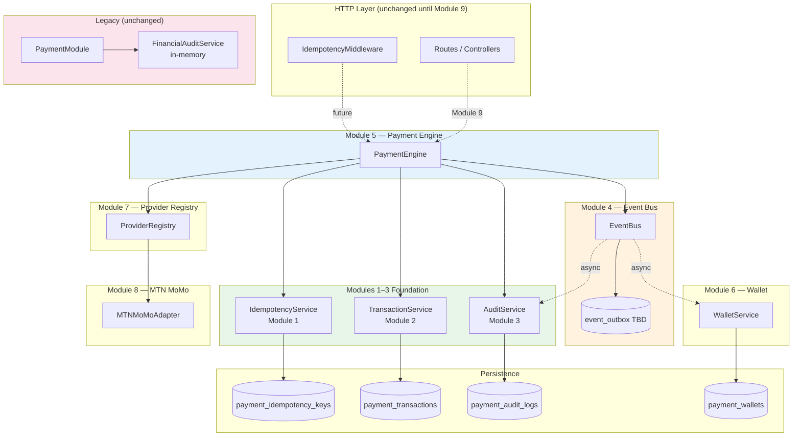

# Payment Foundation Architecture

**Branch:** `feature/payment-foundation`  
**Modules complete:** 1 (Idempotency), 2 (Transactions), 3 (Audit)  
**Status:** Module 3 closed — documentation complete, no runtime wiring

---

## Approved Module Roadmap

```
Module 1  Idempotency Layer          ✅ Complete
    ↓
Module 2  Transaction Foundation     ✅ Complete
    ↓
Module 3  Audit Foundation           ✅ Complete
    ↓
Module 4  Event Bus                  ⏳ Not started
    ↓
Module 5  Payment Engine             ⏳ Not started (depends on 1, 2, 3, 4)
    ↓
Module 6  Wallet                     ⏳ Not started
    ↓
Module 7  Provider Registry          ⏳ Not started
    ↓
Module 8  MTN MoMo Provider          ⏳ Not started
    ↓
Module 9  Integration Gate           ⏳ Wire into PaymentModule (future)
```

**Dependency rule:** Each module depends only on modules above it. No circular dependencies.

---

## Module Overview

| Module | Component | Collection / Artifact | Wired to PaymentModule |
|--------|-----------|----------------------|------------------------|
| 1 | MongoDB Idempotency Layer | `payment_idempotency_keys` | No |
| 2 | Transaction Foundation | `payment_transactions` | No |
| 3 | Audit Foundation | `payment_audit_logs` | No |
| 4 | Event Bus | In-process / MongoDB outbox (TBD) | No |
| 5 | Payment Engine | Orchestrator service | No |
| 6 | Wallet | `payment_wallets` (TBD) | No |
| 7 | Provider Registry | Adapter registry | No |
| 8 | MTN MoMo | Provider adapter | No |
| 9 | Integration Gate | Adapters → PaymentModule | Yes (future) |

---

## Dependency Diagram



**Legend:** Solid arrows = direct dependency. Dashed = future wiring / async subscription.

---

## Dependency Matrix

| Module | Depends on | Depended on by | Imports Foundation? |
|--------|------------|----------------|---------------------|
| 1 Idempotency | — | 2, 5, 8 (webhooks) | — |
| 2 Transactions | — | 3, 5, 6 | — |
| 3 Audit | — | 4 (subscriber), 5 (sync calls) | — |
| 4 Event Bus | — | 5, 6, 8 | No |
| 5 Payment Engine | 1, 2, 3, 4, 7 | 6, 8, 9 | Yes |
| 6 Wallet | 4 | 9 | No (events only) |
| 7 Provider Registry | — | 5, 8 | No |
| 8 MTN MoMo | 7 | 5 | No |
| 9 Integration Gate | 1–8 | — | Yes |

**Circular dependency check:** ✅ None

- Foundation modules (1–3) do not import Engine, Event Bus, or Wallet
- Audit does not import TransactionService (audit is derived)
- Wallet subscribes to events — no reverse calls to Payment Engine
- Provider adapters do not import mongoose or repositories

---

## Module 1 → Module 2 Integration

```
Client Request
    │
    ▼
IdempotencyMiddleware ──► req.idempotencyContext
    │                      (idempotencyKey, correlationId, requestId, paymentReference)
    ▼
Payment Engine (Module 5) ──► IdempotencyService.execute(key, payload, handler)
    │                              │
    │                              ├── First call: run handler
    │                              └── Duplicate: replay cached result
    ▼
TransactionService.createTransaction() / transitionStatus()
    │
    ▼
payment_transactions (MongoDB)
```

| Idempotency record | Transaction field |
|--------------------|-------------------|
| `correlationId` | `metadata.correlationId` |
| `requestId` | `metadata.requestId` |
| `paymentReference` | top-level `paymentReference` |

---

## Module 3 — Audit Foundation (Closed)

```
TransactionService.transitionStatus()
    → PaymentEngine publishes event (Module 5)
    → EventBus (Module 4)
    → AuditService.record() (sync or async subscriber)
    → payment_audit_logs (append-only)
```

- **Production implementation:** `AuditService` (Module 3)
- **Legacy (deprecated at Module 9):** `FinancialAuditService`
- **Migration:** `FinancialAuditAdapter` at integration gate — see [AUDIT_MIGRATION_STRATEGY.md](./audit/AUDIT_MIGRATION_STRATEGY.md)
- **Trace strategy:** [CORRELATION_TRACE_STRATEGY.md](./audit/CORRELATION_TRACE_STRATEGY.md)
- **Timeline design:** [AUDIT_TIMELINE_DESIGN.md](./audit/AUDIT_TIMELINE_DESIGN.md)

---

## Module 4 — Event Bus (Planned)

```
PaymentEngine
    → EventBus.publish(domainEvent)
    → Subscribers (async, no reverse calls):
        • AuditEventSubscriber
        • WalletEventSubscriber
        • NotificationSubscriber
```

Event envelope carries: `traceId`, `correlationId`, `requestId`, `transactionId`, `paymentReference`, `providerReference`.

Event Bus does **not** depend on Audit, Wallet, or Payment Engine internals — only on event contracts.

---

## Module 5 — Payment Engine (Planned)

```
PaymentEngine.charge(request)
    1. IdempotencyService.execute(key, payload, handler)
    2. TransactionService.createTransaction()
    3. AuditService.record(PAYMENT_CREATED)
    4. ProviderRegistry.resolve(method, country)
    5. ProviderAdapter.charge()
    6. TransactionService.transitionStatus(PENDING → CAPTURED → ...)
    7. EventBus.publish(PaymentTransactionStatusChanged)
```

Payment Engine is the **sole orchestrator**. No module below it calls providers or repositories directly.

---

## Module 6 — Wallet (Planned)

```
PaymentTransactionStatusChanged { status: SETTLED }
    → EventBus
    → WalletService.creditSeller()
    → payment_wallets + dual-write Shop.availableBalance
    → AuditService (WALLET_CREDITED via subscriber)
```

---

## Module 7 — Provider Registry (Planned)

```
ProviderRegistry
    → resolve(paymentMethod, country)
    → MTNMoMoAdapter | AirtelAdapter | StripeAdapter | ...
```

Registry imported by Payment Engine only. TransactionService receives normalized `providerReference`.

---

## Module 8 — MTN MoMo (Planned)

```
MTNMoMoAdapter.charge()
    → MTN Collections API
    → returns providerReference

POST /webhooks/mtn-momo
    → WebhookService (future)
    → IdempotencyService.execute(webhookKey, ...)
    → PaymentEngine.reconcileWebhook()
```

First live provider integration. Depends on Module 7 registry.

---

## Module 9 — Integration Gate (Future)

Bridges foundation into legacy `PaymentModule`:

```javascript
const { createMongoIdempotencyLayer } = require("./infrastructure/idempotency");
const { createTransactionFoundation } = require("./infrastructure/transactions");
const { createAuditFoundation } = require("./infrastructure/audit");
// + createPaymentEngine(), createEventBus(), FinancialAuditAdapter

const paymentModule = new PaymentModule({
  financialAuditService: financialAuditAdapter,  // replaces in-memory
  transactionRepository: transactionAdapter,
  paymentEngine,
});
```

---

## Circular Dependency Prevention

| Rule | Enforcement |
|------|-------------|
| Foundation (1–3) does not import Engine or Bus | Architecture verify script |
| Engine imports Foundation — one direction only | Code review + DI |
| Audit/Wallet subscribe to events — no reverse calls | Event Bus contract |
| Providers isolated in adapters | No mongoose in providers/ |
| Legacy PaymentModule unchanged until Module 9 | Separate bootstrap root |

---

## File Map

```
payments/infrastructure/
├── idempotency/              Module 1 ✅
├── transactions/             Module 2 ✅
├── audit/                    Module 3 ✅
│   ├── AUDIT_MIGRATION_STRATEGY.md
│   ├── CORRELATION_TRACE_STRATEGY.md
│   ├── AUDIT_TIMELINE_DESIGN.md
│   └── MODULE_3_CLOSURE.md
├── event-bus/                Module 4 (future)
└── PAYMENT_FOUNDATION_ARCHITECTURE.md
```

---

## Closure Documentation Index

| Document | Purpose |
|----------|---------|
| [audit/README.md](./audit/README.md) | Module 3 usage |
| [audit/AUDIT_MIGRATION_STRATEGY.md](./audit/AUDIT_MIGRATION_STRATEGY.md) | Legacy → production audit migration |
| [audit/CORRELATION_TRACE_STRATEGY.md](./audit/CORRELATION_TRACE_STRATEGY.md) | Trace ID lifecycle |
| [audit/AUDIT_TIMELINE_DESIGN.md](./audit/AUDIT_TIMELINE_DESIGN.md) | Event ordering |
| [audit/MODULE_3_CLOSURE.md](./audit/MODULE_3_CLOSURE.md) | Closure sign-off |
| [transactions/REPOSITORY_MIGRATION.md](./transactions/REPOSITORY_MIGRATION.md) | Transaction repo migration |
| [transactions/METADATA_POLICY.md](./transactions/METADATA_POLICY.md) | Metadata rules |
