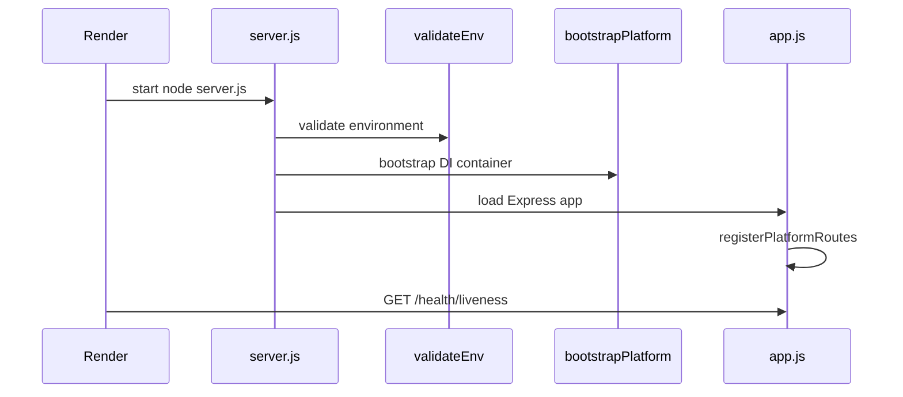

# Render Deployment Guide

This guide covers deploying the Guriraline backend with the platform layer on [Render](https://render.com).

## Prerequisites

- Render account
- MongoDB Atlas connection string (`DB_URL`)
- Cloudinary credentials (if `STORAGE_PROVIDER=cloudinary`)
- Email provider credentials (Resend or SMTP)
- Google OAuth credentials
- Stripe keys (payment module — separate from platform layer)

## Quick Start

1. Connect your GitHub repository to Render.
2. Render detects `render.yaml` at the project root.
3. Set secret environment variables in the Render dashboard (see `.env.production.example`).
4. Deploy — Render uses `/health/liveness` for health checks.

## Environment Variables

Copy values from `.env.production.example`. Required for production:

| Variable | Description |
|----------|-------------|
| `NODE_ENV` | Set to `production` |
| `PORT` | Render sets this automatically (default 10000) |
| `DB_URL` | MongoDB connection string |
| `JWT_SECRET_KEY` | JWT signing secret |
| `ACTIVATION_SECRET` | Account activation secret |
| `GOOGLE_CLIENT_ID` / `GOOGLE_CLIENT_SECRET` | OAuth |
| `BACKEND_URL` / `FRONTEND_URL` | Public URLs |
| `STORAGE_PROVIDER` | `local` or `cloudinary` |
| `EMAIL_PROVIDER` | `smtp`, `resend`, or `placeholder` |

Optional platform variables:

| Variable | Description |
|----------|-------------|
| `POSTGRES_URL` | Future PostgreSQL layer (placeholder) |
| `LOG_LEVEL` | `debug`, `info`, `warn`, `error` |
| `STORAGE_LOCAL_PATH` | Local upload directory |
| `STORAGE_MAX_MB` | Max upload size in MB |

## Health Endpoints

| Endpoint | Purpose |
|----------|---------|
| `GET /health` | Combined health status |
| `GET /health/liveness` | Process alive check (used by Render) |
| `GET /health/readiness` | Dependency readiness (DB, storage, email) |

## Startup Sequence



## Verification Before Deploy

Run locally:

```bash
node platform/scripts/verify-platform.js
```

Expected score: **100/100**.

## Troubleshooting

- **Build fails**: Ensure Node 18.x (`engines` in `package.json`).
- **Health check fails**: Confirm `PORT` matches Render's assigned port.
- **Missing env vars**: Check Render Environment tab against `.env.production.example`.
- **CORS errors**: Add your frontend URL to `allowedOrigins` in `app.js` (outside platform scope).

## Notes

- PostgreSQL integration is placeholder-only; MongoDB remains the primary datastore.
- Storage and email adapters return placeholder responses until real credentials are configured.
- Do not commit `.env` files — use Render's secret management.
